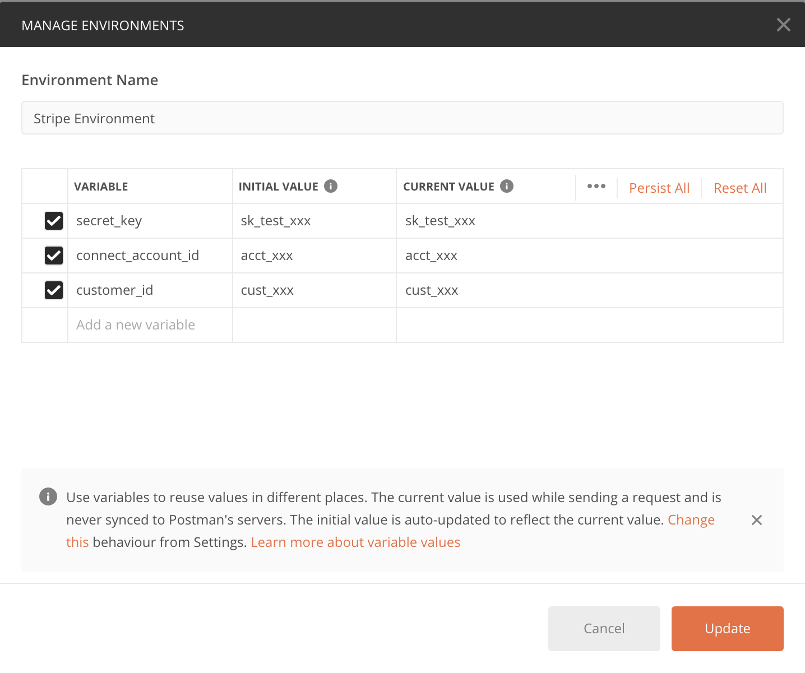

#### A Stripe API Postman collection covering over 200 Stripe API endpoints

## Prerequisites
[Postman](https://www.getpostman.com/downloads/)

[Stripe Account](https://dashboard.stripe.com/register)

## Instructions

Get up and running with this Stripe API Postman collection

1. Import the Postman collection. Copy the [stripe-api-postman-collection.json](https://github.com/mattmitchell6/stripe-api-postman-collection/blob/master/stripe-api-postman-collection.json) contents and paste in the **Import > Paste Raw Text** section.

2. This collection takes advantage of Postman [variables and environments](https://learning.getpostman.com/docs/postman/variables-and-environments/variables/#understanding-variables-and-environments) to store/access your Stripe secret key and commonly used Stripe object IDs.

* **secret_key** - Your Stripe secret API key. Found by navigating to [Developers > API](https://dashboard.stripe.com/test/apikeys) on the left-hand side of the Stripe Dashboard.
* **customer_id** - Stripe [Customer object](https://stripe.com/docs/api/customers). Used when creating recurring subscriptions, charging an existing customer, listing charges for an existing customer, etc.
* **connect_account_id** - Stripe [Account object](https://stripe.com/docs/api/accounts). Used with Stripe's [Connect product](https://stripe.com/docs/connect).

3. Make an API Request! Make sure your Stripe Environment is active and your variable definitions match those listed above.

Postman Environment Example:

